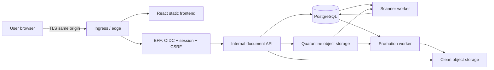

# Document Upload Example Architecture Baseline

## Scope and status

This is a proposed design for a secure document-upload service on the existing Proxmox/Talos/Kubernetes platform. It is reviewable architecture, not apply-ready infrastructure.

## Components

| Component | Responsibility | External exposure |
|---|---|---|
| React frontend | Accessible upload/status UI; no authorization authority | Through same-origin edge only |
| BFF | OIDC callback, server-side session, CSRF enforcement, API proxy | `/`, static assets, `/auth/*`, `/api/*` |
| Document API | Object authorization, upload streaming, metadata and lifecycle | Cluster-internal only |
| PostgreSQL | Sessions, metadata, authorization links, idempotency, audit/outbox, scan jobs | Cluster-internal only |
| Quarantine storage | Untrusted uploaded bytes | API/scanner access only |
| Scanner worker | Content inspection in an isolated workload | No ingress |
| Promotion worker | Moves/copies clean content to clean storage after valid verdict | No ingress |
| Clean storage | Retrievable approved content | API access only |
| GitLab pipeline | Test, scan, build, sign, promote, deploy | Protected runner/environment boundaries |

## Logical topology

## Trust boundaries

1. Internet/browser to ingress and BFF.
2. BFF session boundary to internal API identity.
3. API to PostgreSQL and object storage.
4. Untrusted quarantine to isolated scanner.
5. Scanner verdict to trusted promotion authority.
6. Namespace workloads to Kubernetes control plane and platform services.
7. GitLab runners/registry to deployment environments.
8. Operators and observability systems to metadata and audit records.

## Identity and authorization

- Use OIDC Authorization Code with PKCE, state, nonce, exact redirect allowlists, issuer/audience/algorithm validation, key rotation, and bounded clock skew.
- Store tokens server-side. Issue a random opaque session identifier in a `Secure`, `HttpOnly`, host-scoped cookie with the narrowest workable `SameSite` setting.
- Require CSRF tokens for state-changing browser requests. Rotate the session on authentication and privilege changes; define idle and absolute expiry.
- Derive subject and tenant from validated identity mapping. Never trust browser-supplied ownership or tenant fields.
- Enforce object authorization in the API and scope PostgreSQL queries by tenant/owner or explicit grant.

## Data and consistency

- PostgreSQL is authoritative for document identity, ownership, status, hash, size, storage locator, retention, and audit state.
- Stream uploads through the API into quarantine while computing size and SHA-256. Do not hold complete files in memory.
- Bind the idempotency key to tenant, subject, request digest, and result. A conflicting reuse returns a deterministic conflict.
- Create scan work transactionally in PostgreSQL. Workers claim jobs with leases and bounded retries; operations are idempotent.
- Scanner verdict alone does not expose content. A trusted promotion worker verifies expected state/version/hash before copying to clean storage and committing `clean` state.
- Reconciliation detects orphaned rows, blobs, expired leases, and inconsistent clean/quarantine states.

## Platform controls

- Deploy into a dedicated namespace with separate BFF, API, scanner, and promotion service accounts.
- Default-deny ingress and egress. Permit only documented DNS, BFF-to-API, API-to-PostgreSQL/quarantine/clean, scanner-to-quarantine/PostgreSQL, and promotion-to-storage/PostgreSQL flows.
- Enforce non-root execution, read-only root filesystems, dropped capabilities, seccomp, no privilege escalation, bounded ephemeral storage, requests/limits, probes, disruption budgets, and topology spread.
- Reference secrets through the approved secret mechanism. Never render credentials into Helm output, Terraform output/state, frontend bundles, or GitLab logs.
- Expose only the ingress/BFF. API, PostgreSQL, scanner, and object stores remain private.

## Availability and recovery

- Do not claim HA, RPO, or RTO until PostgreSQL/object-store topology and human-owned objectives are approved.
- Backup PostgreSQL and object storage with encryption, independent access controls, retention, integrity checks, and routine restore tests.
- Restore order must preserve metadata/object consistency and scan/promotion state. Run reconciliation before reopening downloads.
- Use expand/migrate/contract schema changes and mixed-version compatibility. Prefer forward remediation over destructive rollback.

## Observability

Correlate authentication, upload, scan, promotion, retrieval, and deletion with opaque request/document identifiers. Record actor, tenant, decision, hash, scanner/version, and state transition without tokens, cookies, document content, credentials, or unnecessary filenames.
