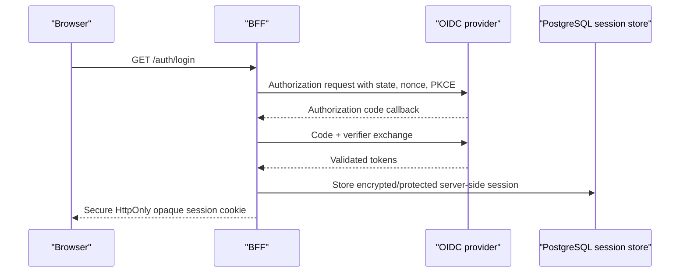

# SAMPLE-001 Data Flows

## Authentication



Tokens never enter browser storage or URLs after callback handling. State, nonce, redirect URI, issuer, audience, signature algorithm, expiry, and key source are validated before session creation.

## Upload and scan

```mermaid
sequenceDiagram
    participant U as "Browser"
    participant B as "BFF"
    participant A as "Document API"
    participant P as "PostgreSQL"
    participant Q as "Quarantine storage"
    participant S as "Scanner"
    participant M as "Promotion worker"
    participant C as "Clean storage"
    U->>B: POST /api/v1/documents + CSRF + idempotency key
    B->>A: Stream request with verified internal identity
    A->>A: Enforce authorization, size, type and quota
    A->>Q: Stream bytes; compute size and SHA-256
    A->>P: Commit metadata + idempotency + scan job
    A-->>B: 202 + opaque document ID + pending status
    B-->>U: 202 + safe status representation
    S->>P: Claim leased scan job
    S->>Q: Read quarantined object
    S->>P: Write signed/bound verdict with engine version
    M->>P: Claim clean promotion
    M->>Q: Read expected hash/version
    M->>C: Copy immutable clean object
    M->>P: Commit clean locator and clean state
```

Failures leave the document non-downloadable. Retried steps must verify tenant, object ID, expected version, and hash.

## Retrieval

1. Browser sends session cookie to the same-origin BFF.
2. BFF validates session and CSRF rules appropriate to the operation.
3. API derives tenant/subject from trusted BFF identity and queries by both object ID and authorization scope.
4. API permits content only in `clean` state and streams from clean storage with safe content headers.
5. Active document formats are downloaded or served from an isolated origin; they are never rendered in the application origin.

## Deletion

1. API authorizes deletion and records `delete_pending` plus an audit event.
2. A lifecycle worker removes clean and quarantine objects idempotently.
3. Metadata becomes `deleted` only after required object actions succeed or an approved retention/legal-hold rule records why deletion is deferred.
4. Backup expiry follows the approved retention schedule; immediate physical erasure is not claimed unless the storage design can prove it.

## Prohibited flows

- Browser directly to PostgreSQL, scanner, Kubernetes API, or private object-storage administration.
- Scanner to clean storage, OIDC tokens, application secrets, or unrelated network destinations.
- Frontend bundle or Helm/Terraform output containing database, OIDC-client, storage, or signing credentials.
- Retrieval from quarantine, pending, rejected, error, or deleted states.
