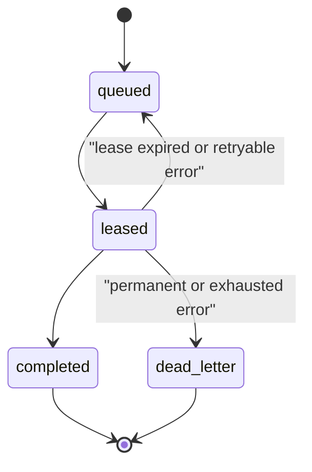
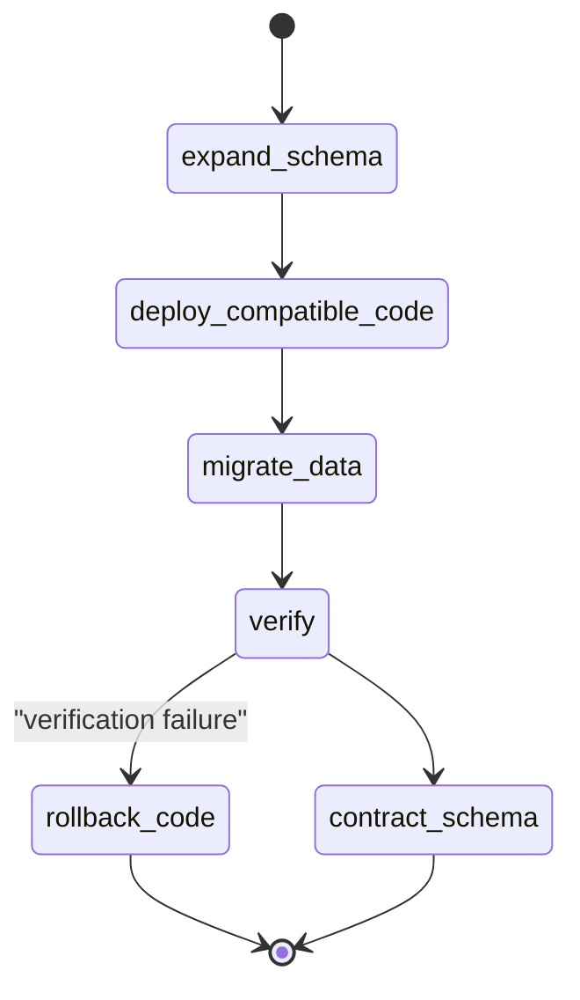

# Document Upload Example State Machines

## Document lifecycle

```mermaid
stateDiagram-v2
    [*] --> uploading
    uploading --> pending_scan: "bytes and metadata committed"
    uploading --> upload_failed: "validation/storage/client failure"
    pending_scan --> scanning: "worker lease acquired"
    scanning --> pending_scan: "retryable failure; bounded retry"
    scanning --> rejected: "malicious or prohibited"
    scanning --> scan_error: "permanent/exhausted failure"
    scanning --> promotion_pending: "clean verdict bound to hash/version"
    promotion_pending --> clean: "clean object committed"
    promotion_pending --> scan_error: "promotion exhausted"
    clean --> delete_pending: "authorized lifecycle request"
    rejected --> delete_pending
    scan_error --> delete_pending
    upload_failed --> delete_pending
    delete_pending --> deleted: "required object deletion confirmed"
    deleted --> [*]
```

Invariants:

- Only `clean` content may be retrieved.
- State transitions use optimistic version checks and append an audit event.
- A clean verdict is valid only for the exact tenant, document, object version, size, and hash.
- Retry exhaustion fails closed; it never promotes or exposes content.
- Legal hold/retention may delay deletion but must be explicit and auditable.

## Scan-job lifecycle

Job requirements:

- Unique logical job per document version and scan-policy version.
- Lease owner and expiry are persisted; stale workers cannot commit results.
- Retries use bounded exponential backoff with jitter and permanent-error classification.
- Dead-letter state alerts an owner and keeps the document non-downloadable.

## Deployment compatibility

Contract migrations occur only after all supported application versions stop using the old schema and recovery evidence is current. Persistent migrations and destructive schema actions require explicit human approval.
